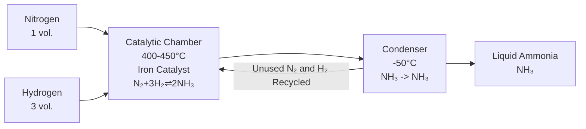

The Haber Process is an industrial process to make ammonia. It reacts nitrogen and hydrogen. 
$$\ce{N2 +3H2 <-> 2NH3}$$

> [!NOTE] Note
> **Must** have an **Iron** catalyst
> It is a **reversible** reaction

---

The **forward reaction** is **exothermic** and the **reverse** is **endothermic**.
**High temps** favour the **reverse reaction** (Bad), so **lower temps** are used to favour the production of ammonia.
If the temp is **too low**, the reaction is **too slow** to be **economical**.

> [!NOTE] Why is a condenser used?
> The condenser is used to **separate** the ammonia from the H₂ and N₂ because the ammonia will **become a liquid** at **-33°C** while the H₂ and N₂ will still be a gas.
