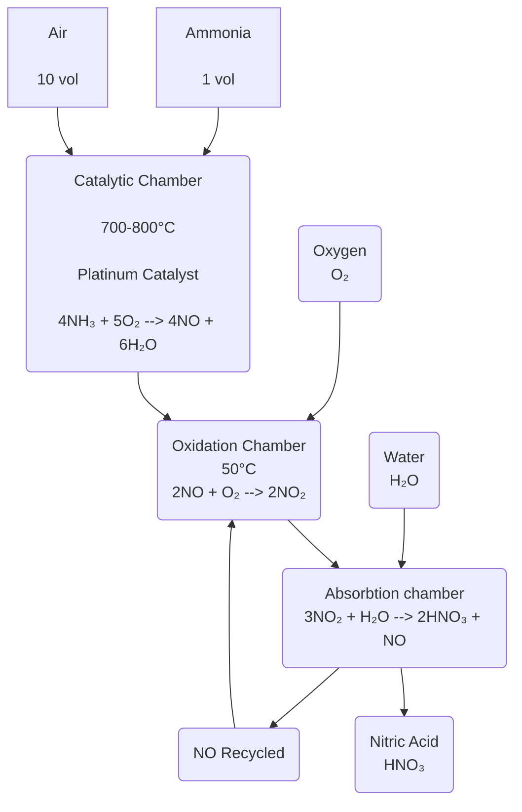

Like the Haber process, **Ostwald** is an **industrial** process for manufacturing **Nitric Acid**. $$\ce{HNO3}$$It utilises **ammonia, oxygen** and **water** as its feed stocks.

```mermaid
flowchart TD

A[Ammonia

1 vol] --> C(Catalytic Chamber

700-800°C

Platinum Catalyst

4NH₃ + 5O₂ --> 4NO + 6H₂O

)

B[Air

10 vol] -->C

D(Oxygen
O₂) --> E

C --> E(Oxidation Chamber
50°C
2NO + O₂ --> 2NO₂)

E --> G(Absorbtion chamber
3NO₂ + H₂O --> 2HNO₃ + NO)

F(Water
H₂O) --> G

G --> H(Nitric Acid
HNO₃)

G --> I(NO Recycled)

I --> E
```

